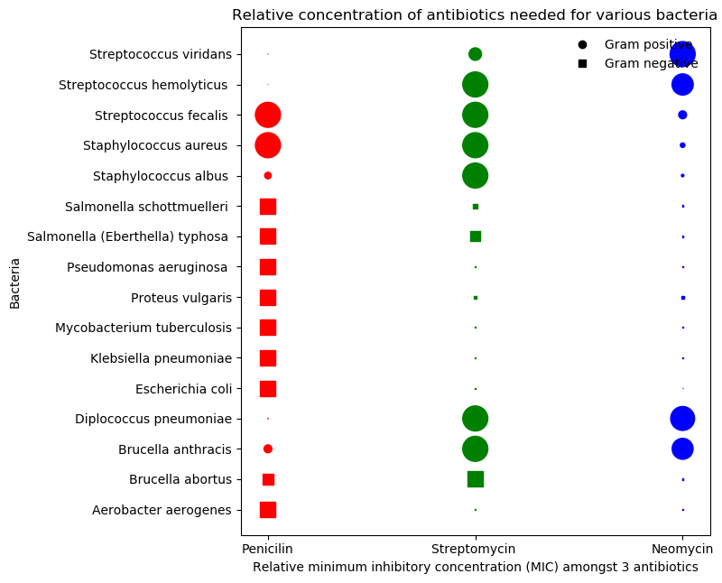

This plot is meant to illustrate the amount of antibiotic needed to counter various bacteria. Here,
relative concentration is used because absolute scales become too large. The data variables are antibiotic type, antibiotic concentration, bacteria, gram staining. 

Since the goal is to show patients how much of each antibiotic they would need to counter a bacteria, the most important data variables to be compared are the antibiotic type. Hence, they are visually encoded by position on the x-axis and by color as well. 

The next important variable is antibiotic concentration. We could encode it by position on the y-axis. However, that does not allow us to compare between anitbiotics for each bacteria effectively. So, the visual encoding chosen is length (radius) because concentration is quantitative. 

The next important variable is bacteria which is encoded by position on the y-axis (Nominal variable encoded nominally). Lastly, gram staining is the least relevant information and is encoded by shape.
