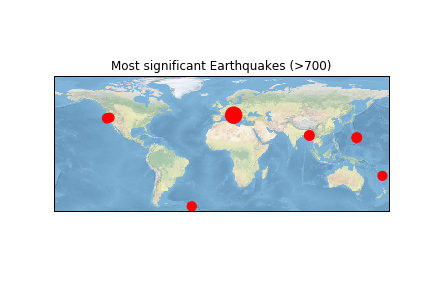
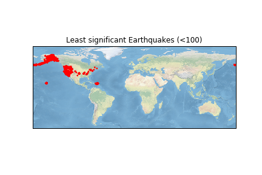

Exploratory data analysis - Taking a look at earthquakes.

 
I got interested in the earthquakes dataset from CORGIS. Since I had previously worked on tsunamis, this seemed like
a nice field to explore and find some patterns. My vague question right now is to see how the impact and timing of earthquakes depends on previous earthquakes 
spacially.

After extracting the dataset, I plotted it.

After looking at the specific data of a few points, I realized I made a mistake because California seemed to be near Austrialia (I had switched latitude and longitude.)
The corrected version is below.

Not all earthquakes are the same. So, I added the 'significance' of the earthquake as the radius in the scatterplot. However, the visualization is less effective.

So, I turned to see if earthquakes triggered other earthquakes in nearby locations. I first checked the last 3 instances and found them very close to each other.

 The last 10 instances seemed to agree and the last 50 seem to show some clustering.

Plotting the instance over time revealed that I could not get a sense of time from this graph.

So, I converted the time metric 'epoch' to seconds, months, days and time. Here, I visualize the significance of the earthquakes to the day it occurred (Assuming we start at day 0).

Doesn't help much. I also learnt at this point that even though there were around 9000 instances, the time period was only over a month so I would not be able to visualize any yearly patterns. Nevertheless, let's try to say something about the data we have.

The plot above shows the most significant earthquakes spaced out. So, one question I want to ask is if the most significant earthquakes occur in the same location as the non-significant ones. So, it seems the most significant earthquakes (sign. >700) appear here.

Solarized dark             |  Solarized Ocean
:-------------------------:|:-------------------------:
 |  

  
