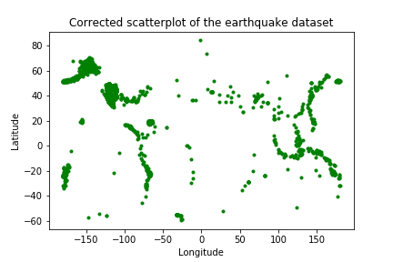
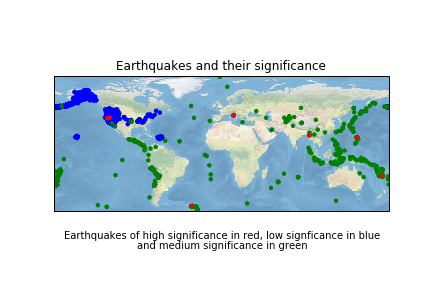

Exploratory data analysis - **Taking a look at earthquakes**.

 
I got interested in the earthquakes dataset from CORGIS (https://corgis-edu.github.io/corgis/csv/earthquakes/). Since I had previously worked on tsunamis, this seemed like
a nice field to explore and find some patterns. My vague question right now is to see how the impact and timing of earthquakes depends on previous earthquakes 
spacially.

After extracting the dataset, I plotted it.

After looking at the specific data of a few points, I realized I made a mistake because California seemed to be near Austrialia (I had switched latitude and longitude.)
The corrected version is below.

Not all earthquakes are the same. The impact of an earthquake depends on its magnitude and depth, both of which are encoded in its signficance. So, I added the 'significance' of the earthquake as the radius in the scatterplot. However, the visualization is less effective.

So, I turned to see if earthquakes triggered other earthquakes in nearby locations. I first checked the last 3 instances and found them very close to each other.

 The last 10 instances seemed to agree and the last 50 seem to show some clustering.

Plotting the instance over time revealed that I could not get a sense of time from this graph.

So, I converted the time metric 'epoch' to seconds, months, days and time. Here, I visualize the significance of the earthquakes to the day it occurred (Assuming we start at day 0).

Doesn't help much. I also learnt at this point that even though there were around 9000 instances, the time period was only over a month so I would not be able to visualize any yearly patterns. Nevertheless, let's try to say something about the data we have.

The plot above shows the most significant earthquakes spaced out. So, one question I want to ask is if the most significant earthquakes (>700) occur in the same location as the least significant ones (<100). Please note that the significance of the earthquake is encoded in the plot of the most significant earthquakes to visualize significance but not in the least-significant to have a measure of count. 

  

Seemingly not. Most of the least significant earthquakes happen to be in the US. Let's see what happen when I graph the earthquakes of medium significance

These seem to be spread out more globally. So, this might be an indication that minor tremors in the US are reported well as opposed to other countries.
Going back to the plot of significance of earthquakes over time, let's take the most significant earthquakes and see if the previous 10 earthquakes were nearby.

There are 7 earthquakes with significance over 700.
 
Let us analyze the first one first. I initially thought about taking the previous 10 earthquakes but that may not be right if we want to measure impact. Maybe we should consider earthquakes in the last hour or the last two hours or maybe the last day? My rationale is that earthquakes are seismic waves that travel at 1-5 km/s depending on land or water. 
The circumference of earth is 24,000 km. So, the maximum distance between two points would be 12,000 km. An earthquake would traverse that distance in around 80 mins. So, looking at earthquakes occuring an hour or two before should be sufficient.

Here, the earthquakes are plotted with their color going from blue to yellow showing how long before the big significant earthquake one that particular earthquake happened.
So, the big one would of course have a dark blue color.

Looking at earthquake 1 which seems to be near Japan, it seems that the recent earthquakes occur near the US rather than nearby. 

  

Looking at earthquake 2, we see that there are earthquakes in the vicinity just before the big one happens. 

 

Looking at earthquakes 3 and 4 , we see the same thing. Maybe earthquake 1 was an outlier?
 

 

Earthquake 5 is interesting. I am unable to tell which one of the dark blue spots is the big one. If it's the one near Alaska, then that supports the idea that big earthquakes have small ones in the vicinity right before them.

 
So, I plot the big one in red.
 

Sadly, it's the one near South America with no earthquakes in its vicinity. So, maybe 'big ones' happening in the US seem to have earthquakes preceding it in the vicinity because there is just so much US data in the dataset.

Earthquake 6 is the biggest earthquake by far and it doesn't show any earthquakes near where it occured in Italy. Note that earthquakes seem to be a dime a dozen in the US in almost every graph. 

 

Earthquake 7 takes place in Burma and shows no earthquake in its vicinity.

 

From this limited dataset, we don't see anything conclusive about big earthquakes being preceded by smaller ones nearby.

To summarize, we asked two main questions. 

**Do earthquakes of low significance occur at the same place as those of high significance?**

Tabulating our results in one picture, we have the most significant earthquakes in red, the least significant in blue and those of medium significance in green.

We see that the earthquakes of high significance don't occur near low significant earthquakes which seem to be mostly in the US probably leading to some skew in the data.

**Are highly significant earthquakes preceded by earthquakes in the vicinity?**

The Burma case is used as a representative study and the answer seems to be no.

 
 

