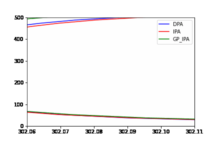
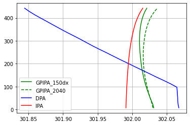
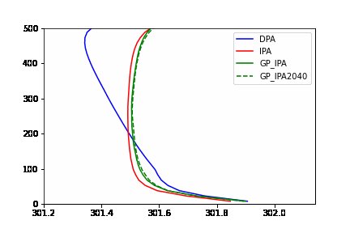

### Without Bias

GP_IPA matches IPA/DPA well while being different. It is pretty similar except towards the end (index 470 to 540) when it acquires a wrong gradient

### With Bias

With Bias, we see that at final time, GP_IPA behaves way better than DPA and the previous iteration of GP and is somewhat in the between. The unbiased problem of acquired a slightly different gradient than IPA is visible here.

