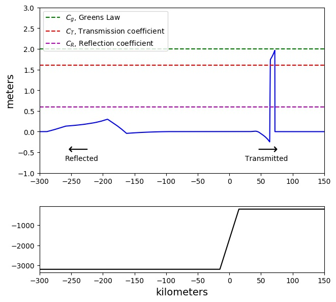

Here are a few of my research highlights. A full list of my publications can be found on [Google Scholar](https://scholar.google.com/citations?user=-Go8DD4AAAAJ&hl=en) or in my [CV](pdfs/CV_Jithin_Nov2022.pdf).

[Paths in the complex plane for timeintegrators](https://arxiv.org/abs/2110.04402)            |  [A visual way to teach the Fast Fourier Transform.](https://sinews.siam.org/Details-Page/a-visual-way-to-teach-the-fast-fourier-transform)
:-------------------------:|:-------------------------:
  |  

[Mysteries in the amplification of ocean waves](https://arxiv.org/abs/1901.04148)            |  [An asymptotic series solution to the wave equation in non-homgeneous media](https://arxiv.org/abs/1901.04158)
:-------------------------:|:-------------------------:
  |  

[Spectral methods for boundary layers in electrocatalysis]()            |  [Fast ways to find optimal locations of atoms](https://link.springer.com/chapter/10.1007/978-3-030-50426-7_13)
:-------------------------:|:-------------------------:
  |  
